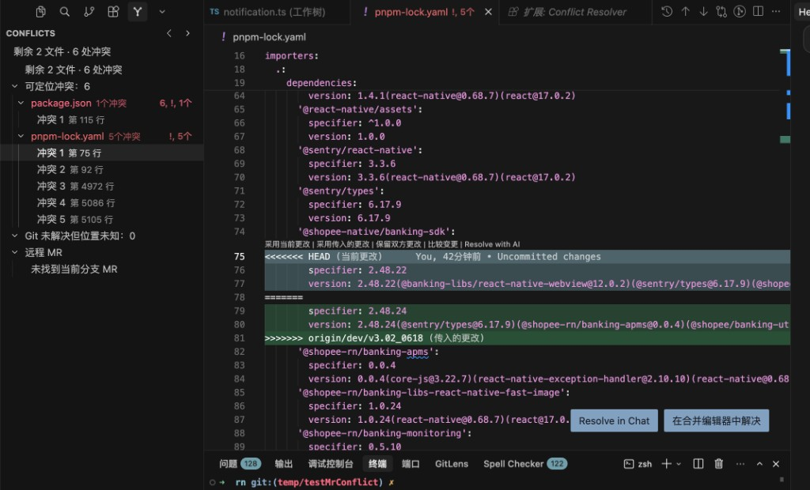
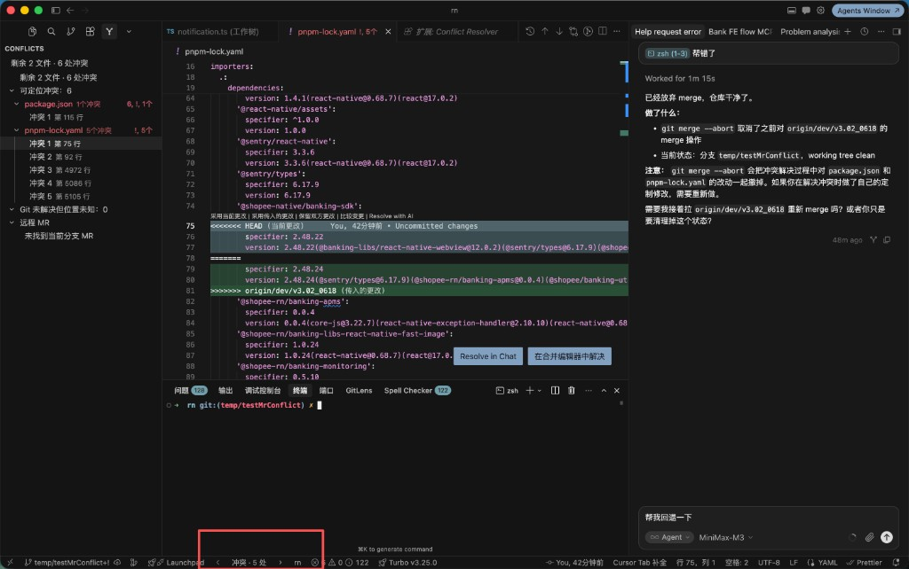
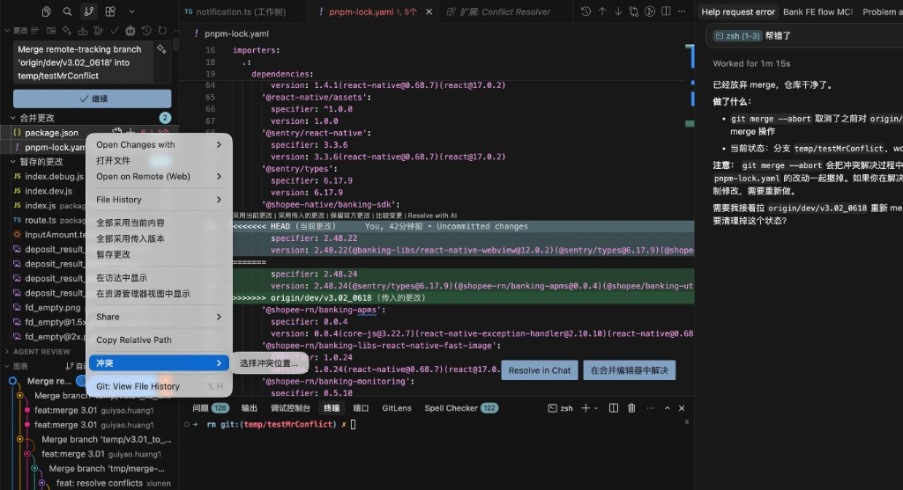
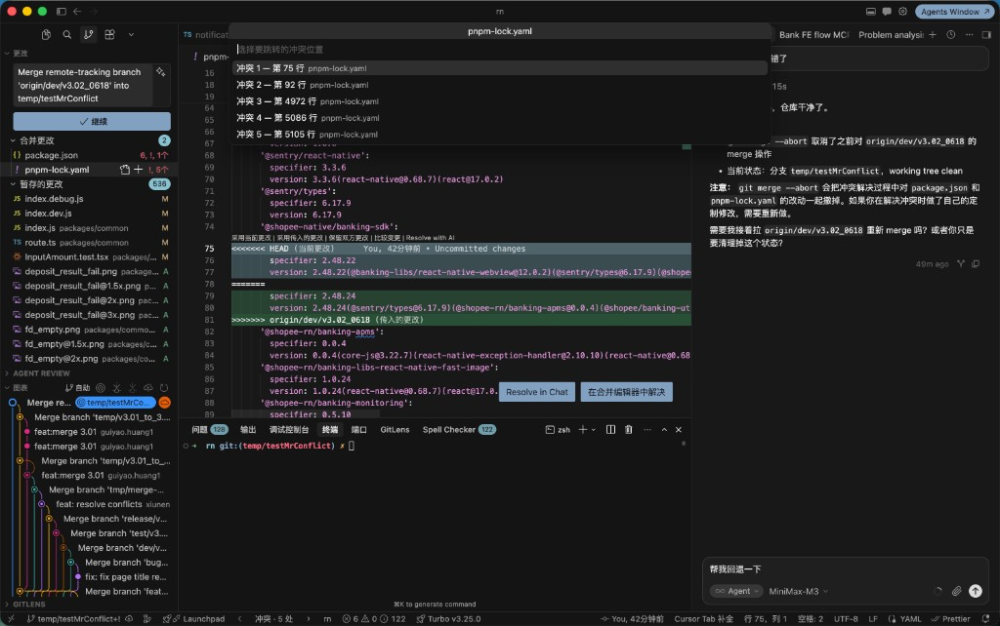

# Conflict Resolver

Conflict Resolver 是一个兼容 VS Code 和 Cursor 的 Git 冲突导航扩展。

仓库：[github.com/Cnnnnnn/conflict-resolver](https://github.com/Cnnnnnn/conflict-resolver)

## 安装

### 方式一：从 GitHub Release 安装（无需插件市场）

1. 打开 [Releases](https://github.com/Cnnnnnn/conflict-resolver/releases) 下载最新 `.vsix`
2. VS Code / Cursor 中 `Cmd+Shift+P` → `Extensions: Install from VSIX...`
3. 选择下载的文件，执行 `Developer: Reload Window`

### 方式二：Open VSX（Cursor 可直接搜索安装）

扩展市场页面：[open-vsx.org/extension/shienLiang/conflict-resolver](https://open-vsx.org/extension/shienLiang/conflict-resolver)

在 Cursor 扩展面板搜索 **Conflict Resolver**（Publisher: `shienLiang`），扩展 ID：`shienLiang.conflict-resolver`

### 方式三：VS Code Marketplace（待发布）

`shienLiang.conflict-resolver`

## 功能

- 在左侧 Conflict Resolver 面板显示冲突文件和冲突数量；
- 点击冲突项跳转到冲突起始位置；
- 支持跨文件的上一个/下一个冲突导航，状态栏显示 `◀ 冲突 2/15 · 3 文件 ▶`，左右箭头可点击跳转；
- 编辑器标题栏和 Conflict Resolver 面板标题栏同样提供上一处/下一处箭头按钮；
- 仍保留单文件内导航命令（`Next/Previous Conflict in File`）；
- 面板顶部和视图消息显示合并进度，例如 `剩余 3 文件 · 8 处冲突`；
- 冲突项悬停可预览 **当前 (HEAD)** / **传入** 内容摘要；
- 冲突项右侧提供 **采用当前** / **采用传入** 一键按钮；未知冲突文件可一键打开 Merge Editor；
- 全部冲突标记处理完后弹出提醒，面板顶部显示 **✓ 完成态**（含 `git add` 提示）；
- 编辑冲突文件时**同步**刷新冲突计数与面板列表（无需等待 Git 全量扫描）；
- 编辑器内冲突 marker 全部清除后，扩展徽章和冲突列表会立即移除该文件；执行 `git add` 后才会从 Git「合并更改」原生列表消失；
- 文件保存、编辑器切换和 Git 状态变化后自动刷新；
- 识别 Git 已记录为 `unmerged`、但文件中没有标准冲突标记的情况；
- 无法定位具体行时尝试打开 Merge Editor，并提供明确的降级提示；
- 对 GitLab 仓库自动查询当前分支对应的 Open MR，并在面板中单独展示远程合并冲突状态；
- 在源代码管理「合并更改」和文件资源管理器中，于冲突文件名旁显示冲突数量徽章。
- **跳过 lock 文件**：`pnpm-lock.yaml` 等默认不扫描（设置 `conflictResolver.includeLockFiles` 可开启），性能更佳；
- **跳到冲突后自动选区**：选中 `<<<<<<<` 到 `=======` 区间，方便直接替换或整体采纳；

## 冲突切换方式

仓库存在可定位冲突时，可用以下三种方式在冲突间跳转（均支持跨文件）。

### 1. 专属冲突面板切换

打开 Activity Bar 的 **Conflict Resolver** 面板，在「可定位冲突」分组中展开文件，点击具体冲突项（如 `冲突 1 · 第 75 行`），编辑器会跳转到对应位置。面板顶部同步显示合并进度（如 `剩余 2 文件 · 6 处冲突`）。



### 2. 底部箭头按钮切换

状态栏左侧显示 `◀ 冲突 · N 处 ▶`（或 `冲突 2/6 · 2 文件`）。点击左右箭头，在**全仓库**冲突间循环跳转，无需打开侧边面板。



编辑器标题栏和 Conflict Resolver 面板标题栏也提供同样的 `◀` / `▶` 按钮。默认快捷键：`Alt+[` 上一个，`Alt+]` 下一个。

展开冲突项后，行右侧有 **← 采用当前** / **→ 采用传入** 按钮；悬停可预览双方内容摘要。

### 4. 完成态与提醒

当所有冲突标记处理完毕时：

- 面板顶部显示 **✓ 冲突标记已处理 · 剩余 N 个文件待 git add**
- 弹出通知提醒执行 `git add`
- 全部 `git add` 后显示 **✓ 合并冲突已全部处理完毕**

### 3. 文件定位切换

在源代码管理「合并更改」中，对冲突文件**右键** → **冲突** 子菜单：

- 若当前文件已打开且路径匹配：直接列出 **冲突 1**、**冲突 2** … 逐项跳转
- 若路径不匹配或冲突较多：选择 **选择冲突位置…**，在 Quick Pick 中按行号跳转





## 使用

1. 在 Git 仓库中打开 VS Code 或 Cursor。
2. 点击 Activity Bar 中的 Conflict Resolver 图标。
3. 使用上方 [三种切换方式](#冲突切换方式) 在冲突间跳转。
4. 使用命令面板执行：
   - `Conflict Resolver: Next Conflict`
   - `Conflict Resolver: Previous Conflict`
   - `Conflict Resolver: Next Conflict in File`
   - `Conflict Resolver: Previous Conflict in File`
   - `Conflict Resolver: Open Conflict Panel`
   - `Conflict Resolver: Rescan Current File`
   - `Conflict Resolver: Open Merge Editor`
   - `Conflict Resolver: Refresh Remote MR`

默认快捷键：`Alt+[` 上一个冲突，`Alt+]` 下一个冲突（可在 Keyboard Shortcuts 中修改）。

## Git-only 未解决状态

如果 Git 索引仍然处于 `unmerged`，但文件中没有可识别的冲突标记，面板会将其放在“Git 未解决但位置未知”分组。扩展不会伪造具体行号；点击或导航时会尝试打开 Merge Editor。

## GitLab 远程 MR 冲突

扩展会通过 `origin` 远程地址识别 GitLab 项目，并查询当前分支对应的 Open Merge Request。远程 MR 状态显示在独立的“远程 MR”分组中，不会混入本地文件冲突的上一个/下一个导航。

### 配置

在设置中配置：

- `conflictResolver.gitlabUrl`：GitLab 实例地址，默认 `https://gitlab.com`
- `conflictResolver.gitlabToken`：GitLab API Token

认证优先级：

1. 环境变量 `GITLAB_TOKEN`
2. 设置项 `conflictResolver.gitlabToken`
3. 无 Token 时尝试匿名请求（取决于实例策略）

Token 仅用于 API 请求 Header，不会写入日志、错误消息或面板文本。

### 远程状态说明

- `存在合并冲突`：GitLab 返回 `has_conflicts: true`
- `无合并冲突`：GitLab 返回 `has_conflicts: false`
- `未找到当前分支 MR`：当前分支没有 Open MR
- `无法连接 GitLab`：网络、权限、Token 或项目识别失败

点击远程 MR 节点会在浏览器中打开 GitLab MR 页面。展开 MR 节点还可以：

- **获取目标分支**：执行 `git fetch origin <targetBranch>`
- **本地预演合并**：使用 `git merge-tree` 在不改动工作区的情况下预估冲突文件数
- **在 GitLab 解决冲突**：打开 MR 的 `/-/conflicts` 页面（仅当远程存在冲突时显示）
- **打开 MR 页面**

## 合并进度

当仓库处于合并冲突状态时，Conflict Resolver 面板顶部会显示进度摘要，例如：

`剩余 3 文件 · 8 处冲突 · 1 处未知冲突`

视图底部的 message 区域也会同步显示同样信息。状态栏悬停可查看该摘要。

## SCM 冲突徽章

扩展会在源代码管理面板的「合并更改」列表，以及文件资源管理器中，为冲突文件显示简短徽章（如 `6个`），悬停可看到完整说明（如 `6个冲突`）。Conflict Resolver 面板文件行右侧会显示完整的 `N个冲突` 文案。

- `6个`、`12个`：可定位的冲突（SCM 徽章受 API 长度限制，显示为「数字+个」）
- `99+`：冲突超过 99 个
- `!`：未知冲突（Git 未解决但定位不到行号）；悬停显示「未知冲突」

## 合并更改右键菜单

详见 [文件定位切换](#3-文件定位切换)。在「合并更改」中右键冲突文件，可打开 **冲突** 子菜单：

- **冲突 1**、**冲突 2** …：跳转到该文件第 N 个可定位冲突（当前文件已打开时）
- **选择冲突位置…**：Quick Pick 按行号选择（路径不匹配或冲突较多时）
- **打开 Merge Editor**：用于无法定位具体行号的未合并文件

## 限制

- 第一版远程冲突检测仅支持 GitLab MR，不连接 GitHub、Bitbucket 或其他平台；
- 不自动解决远程或本地冲突，也不通过 MR API 获取具体冲突行号；
- 大文件会降低实时扫描频率，优先在保存时刷新；
- GitLab 不可用时，本地冲突检测仍会继续工作。

## 开发

```bash
npm install
npm run check
```

打包：

```bash
npx @vscode/vsce package
```

## 发布（维护者）

GitHub Actions 已自动处理发版流程（`.github/workflows/release.yml`）：

```bash
git tag v0.0.5
git push origin v0.0.5
```

工作流会自动：跑测试 → 打包 VSIX → 发布到 Marketplace + Open VSX → 创建 GitHub Release。

### VS Code Marketplace

1. 在 [Marketplace 管理页](https://marketplace.visualstudio.com/manage) 创建 Publisher：`shienLiang`
2. 在 [Azure DevOps](https://dev.azure.com/_users/settings/tokens) 创建 PAT，Scope 选 **Marketplace → Manage**
3. 登录并发布：

```bash
nvm use 22
npx @vscode/vsce login shienLiang
npm run publish:marketplace
```

### Open VSX（Cursor 等）

1. 在 [open-vsx.org](https://open-vsx.org) 用 GitHub 登录并关联 Publisher
2. 在 [Access Tokens](https://open-vsx.org/user-settings/tokens) 创建 Token
3. 发布：

```bash
npx ovsx publish -p <你的-open-vsx-token>
```

扩展目标平台为 Windows、macOS 和 Linux，运行时依赖本机 Git 命令。
